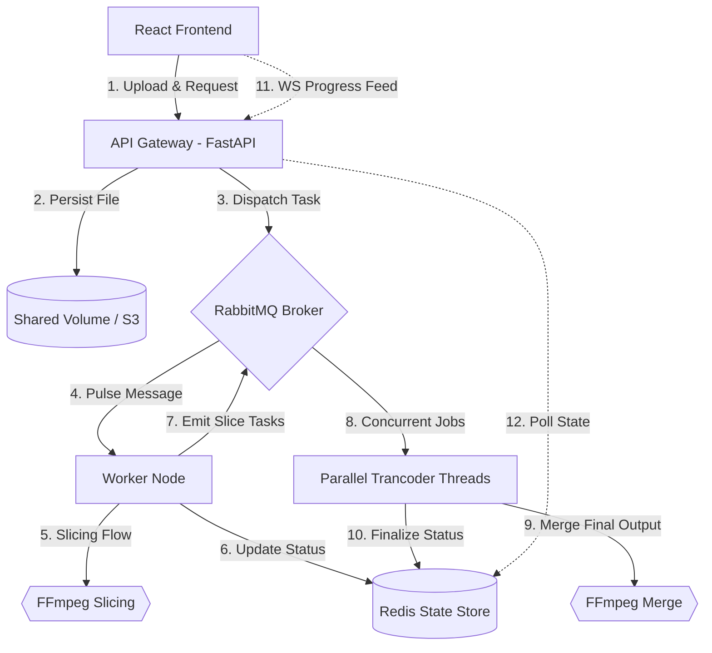

# Scalable Video Transcoding Platform

[]()
[]()

A high-performance, distributed video transcoding system designed to handle large-scale processing workloads via microservices architecture and parallel execution pipelines.

## 🚀 Overview

Processing high-resolution video is computationally expensive and time-consuming. This project addresses latency challenges by implementing a **Distributed Parallel Transcoding** strategy. By segmenting videos into concurrent chunks, the system significantly reduces end-to-end processing time and maximizes hardware utilization across a cluster of worker nodes.

### Key Features
*   **Parallel Processing Pipeline**: Automatic video segmentation (slicing) using FFmpeg to enable concurrent transcoding of a single file.
*   **Decoupled Architecture**: Utilizes RabbitMQ as a reliable message broker to isolate the API Gateway from compute-intensive worker tasks.
*   **Real-time Visibility**: Low-latency status updates and progress tracking powered by Redis and WebSockets.
*   **Fault Tolerance**: Transactional task management ensuring that failed slices are retried or reported without compromising the entire job.

---

## 🏗️ Architecture & System Design

The system follows a **Producer-Consumer** pattern across isolated containers:



### Design Rationale for Interviewers:
*   **Scalability**: Worker nodes can be horizontally scaled using `docker-compose --scale worker=N` to handle increased request volume.
*   **Availability**: By separating "Slicing" from "Transcoding" tasks, the system avoids head-of-line blocking and ensures high availability of the API interface.
*   **Resource Efficiency**: Threads are dynamically allocated per chunk based on available cores and user-defined slice counts.

---

## 🛠️ Tech Stack

*   **Backend**: Python (FastAPI, Pika, Redis-py)
*   **Processing**: FFmpeg (via `ffmpeg-python`)
*   **Middleware**: RabbitMQ (Messaging), Redis (State & Progress)
*   **Frontend**: React 19 (Vite, WebSockets, Tailwind/Glassmorphism)
*   **Infrastructure**: Docker & Docker Compose

---

## 💻 Quick Start

### Prerequisites
*   [Docker Desktop](https://www.docker.com/products/docker-desktop/) installed.

### Installation & Execution
1.  Clone the repository:
    ```bash
    git clone https://github.com/zeyong-jiang/video-transcoding-platform.git
    cd video-transcoding-platform
    ```
2.  Launch the services:
    ```bash
    docker-compose up -d --build
    ```
3.  Access the platform:
    *   **Frontend**: [http://localhost:80](http://localhost:80)
    *   **API Documentation**: [http://localhost:8000/docs](http://localhost:8000/docs)
    *   **RabbitMQ Management**: [http://localhost:15672](http://localhost:15672) (guest/guest)

---

## 🔍 System Walkthrough

1.  **Ingestion**: The client uploads a video. The **API Gateway** stores the raw file in a shared volume (simulating S3) and publishes a `new_video` task.
2.  **Slicing**: A **Worker** receives the task and segment the video into $N$ fragments (default: 5). It then publishes $N$ individual `chunk_task` messages back to RabbitMQ.
3.  **Parallel Transcoding**: Multiple worker threads/processes pick up individual chunks simultaneously. Each chunk is transcoded to the target format (e.g., MP4/H.264) using hardware-optimized FFmpeg commands.
4.  **Merging**: Once Redis confirms all $N$ chunks are processed, the system triggers a `merge_task`. FFmpeg concatenates the fragments into the final output file.
5.  **Feedback Loop**: Throughout the process, the **WebSocket** server polls Redis every second to provide the user with a fluid, real-time progress bar.

---

## 📈 Future Enhancements
*   [ ] **Cloud Integration**: Replace Docker Volumes with actual AWS S3 buckets for global scalability.
*   [ ] **GPU Acceleration**: Implement NVIDIA NVENC support within Docker for faster hardware-accelerated transcoding.
*   [ ] **Observability**: Integrate Prometheus and Grafana for monitoring worker throughput and queue latency.

---

### License
MIT License. Created by [Zeyong Jiang](https://github.com/zeyong-jiang).
